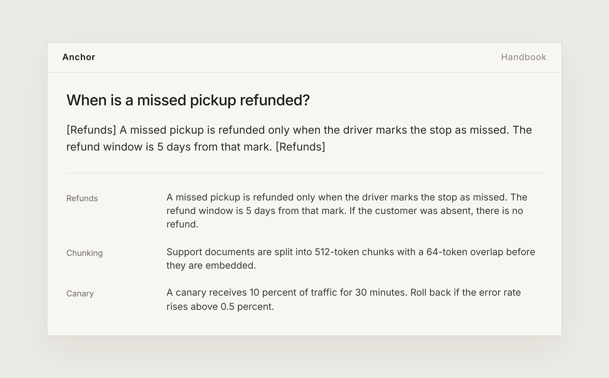
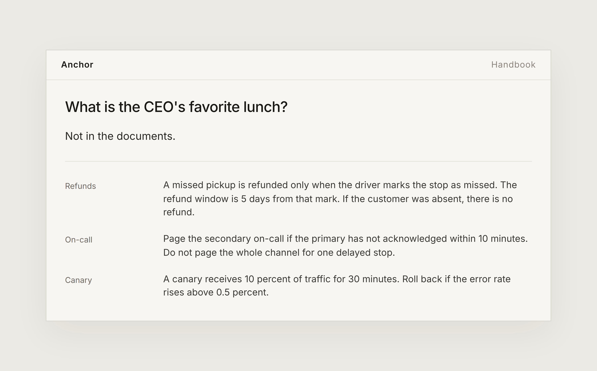

# Anchor

A LangChain RAG chain. It splits a small handbook, embeds the chunks, retrieves the nearest ones, and asks a chat model to answer only from that context.

Without `OPENAI_API_KEY`, the same chain uses a local embedding and `GroundedChat`. With the key set, those two pieces become `OpenAIEmbeddings` and `ChatOpenAI`. The prompt, the splitter, and the retriever stay put.

## What an answer looks like

A question about refunds comes back with the five-day rule and the `[Refunds]` note. The three retrieved chunks sit under it.



A question the handbook never answers is refused. The chunks can still be nearby. The model does not use them to invent a lunch.



## Ask

```bash
pip install -r requirements.txt
python ask.py "When is a missed pickup refunded?"
python ask.py "What is the CEO's favorite lunch?"
```

The first answer cites `[Refunds]`. The second is `Not in the documents.`

```bash
python -m unittest tests/test_chain.py
```

## The chain

`src/anchor/chain.py` builds it:

1. `RecursiveCharacterTextSplitter` cuts each note.
2. `InMemoryVectorStore` stores the chunks.
3. A retriever passes the top three into a `ChatPromptTemplate`.
4. The chat model must cite the source title, or refuse.

Set `OPENAI_API_KEY` when you want the OpenAI model in that last step.
